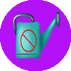
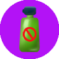
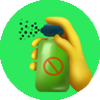
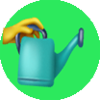

# Plant's gene

:gem:Plant's gene is a function that determines which gene your plant had. According to that, it will help a lot in the farming process, also decided how worth your plant is.

1. There are **10 types of genes**
2. Plant from :star:1 star -> :star:4 star will have 2 genes . Only :star:5 have 3 genes
3. You will get **randomly Gene** when you buy seed box in Shop
4. Every Genes \*\*\*\* have **different appearance rate** ( detail rate % in table below )
5. For now, Plant's gene will be **permanent and irreplaceable** ( there will be items to change a new gene in the future - Q1/2022 )

| **Name of gene**                                               | **Description**                                          | **Appearance rate** |
| -------------------------------------------------------------- | -------------------------------------------------------- | ------------------- |
| **1. Drink Enough**     | No need to watering                                      | 5%                  |
| **2. Friendly Worms** | No need to use pesticide ( no worms )                    | 5%                  |
| **3. Tick Tock**           | Reduction 1 hour in harvest                              | 5%                  |
| **4. Tick Tock Gold**  | Reduction 2 hours in harvest                             | 5%                  |
| **5. Lucky Day**           | Have 1% get normal box when harvest                      | 5%                  |
| **6. Lucky Day Gold**  | Have 2% get normal box when harvest                      | 5%                  |
| **7. iHarvest**            | Automatic harvest all plants in "harvestable condition". | 10%                 |
| **8. iSpray**                | 
Reduction 2 hour when spraying ( Owner only )
  | 10%                 |
| **9. iWater**                | 
Reduction 1 hour when watering ( Owner only )
  | 10%                 |
| **10. The HappyFace**  | Let's smile even you have nothing.                       | 40%                 |
