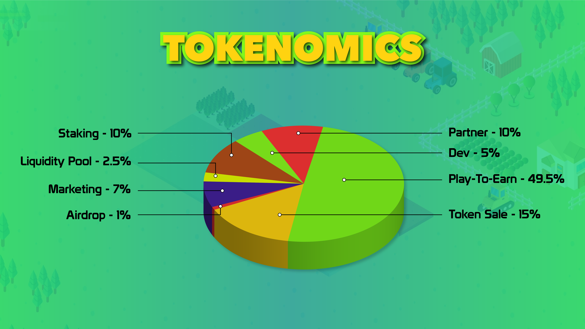

# Token Allocation

**Name** : Farm Finance Token

**Symbol** : FFT

**Total supply** : 200,000,000

|                  | <mark style="color:blue;">**Total Token ( FFT )**</mark>        | <mark style="color:blue;">**Note ( Locked link )**</mark>                                                                                                                                                                                                                                                                          | <mark style="color:blue;">**Total Supply ( % )**</mark> |
| ---------------- | --------------------------------------------------------------- | ---------------------------------------------------------------------------------------------------------------------------------------------------------------------------------------------------------------------------------------------------------------------------------------------------------------------------------- | ------------------------------------------------------- |
| **Play To Earn** | 99,000,000 ( Lock Contract )                                    | [0xf205cec3ffc4c4974ac773d9b3f59f8e8501d5cf](https://bscscan.com/token/0xf205cec3ffc4c4974ac773d9b3f59f8e8501d5cf)                                                                                                                                                                                                                 | 49.5%                                                   |
| **Private Sale** | 10,000,000 ( Unlocked 25% at TGE, then each 25% in week after ) | [Contributed 1,272,426 FFT ](https://t.me/FarmFinanceChannel/82)( 8,727,574 FFT will be burned )                                                                                                                                                                                                                                   | 5%                                                      |
| **PreSale**      | 20,000,000                                                      | [Contributed 5,400,000 FFT Hardcap on Pinksale](https://www.pinksale.finance/#/launchpad/0x9eD9ba79791484988Bb8c6042633e655b775fE0B).  ( 14,600,000 FFT will be burned frequently. It will public on announcements                                                                                                                 | 10%                                                     |
|                  |                                                                 |                                                                                                                                                                                                                                                                                                                                    |                                                         |
| **Airdrop**      | 2,000,000                                                       | Distributed 400,000 FFT ( 1,600,000 FFT will be added to giveaway events )                                                                                                                                                                                                                                                         | 1%                                                      |
| **Marketing**    | 14,000,000                                                      | [10,000,000 FFT has been distributed to NULS for staking and locked for 4 years](https://wallet.nuls.io/pocm/Projects/ProjectsInfo?releaseId=237) -- The rest will be used for marketing campaign in future : [0xD934aBD3F72e6332b4eFF6B22Ec22E636752c1D3](https://bscscan.com/address/0xD934aBD3F72e6332b4eFF6B22Ec22E636752c1D3) | 7%                                                      |
|                  |                                                                 |                                                                                                                                                                                                                                                                                                                                    |                                                         |
| **Liquidity**    | 5,000,000 ( Lock 1 year )                                       |                                                                                                                                                                                                                                                                                                                                    | 2.5%                                                    |
| **Staking**      | 20,000,000 ( Lock Contract )                                    | [0x939b3fe604adb73020ab90b0e8a6a09972cdc85a](https://bscscan.com/address/0x939b3fe604adb73020ab90b0e8a6a09972cdc85a)                                                                                                                                                                                                               | 10%                                                     |
| **Team**         | 10,000,000 ( Lock 1 year, then unlocked 20% each month )        | [Locked link](https://www.pinksale.finance/#/pinklock/record/11250)                                                                                                                                                                                                                                                                | 5%                                                      |
| **Partner**      | 20,000,000 ( Lock 6 months, then unlocked 20% each month )      | [Locked link](https://www.pinksale.finance/#/pinklock/record/11251?chain=BSC)                                                                                                                                                                                                                                                      | 10%                                                     |

