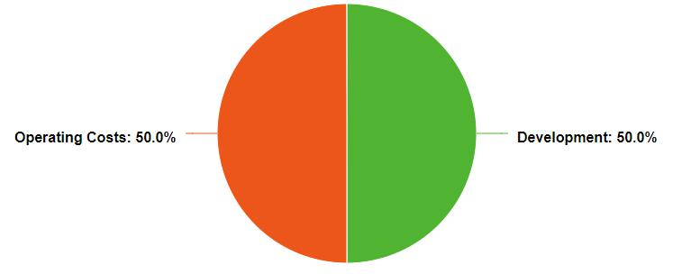
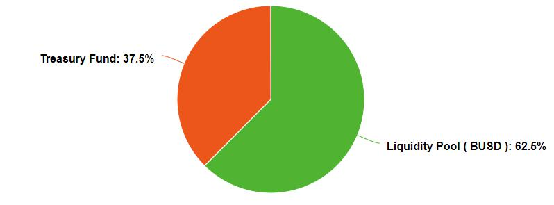

# Token Sale Allocation

We will organize 2 token sale events : Private Sale and IDO Listing ( Presale )

### 1/ Private Sale

This will be a closed funding round. We'll not public on any token sale platform. Contact our official social channel for more information ( big investor, KOL, venture is priority ).

**ONLY CONTACT AND CHECK OUR TOKEN CONTRACT ON OFFICIAL CHANNELS**

<mark style="color:red;">**1 BNB \~ 27,000 FFT**</mark>

Total supply : 10,000,000 FFT

Vesting : 25% at TGE, then each 25% in weeks after.

Fund raised allocate :

###

### 2/ Presale

Presale will be organized in Public platform ( TBA )

**ONLY CONTACT AND CHECK OUR TOKEN CONTRACT ON OFFICIAL CHANNELS**

Date : TBA

<mark style="color:red;">**1 BNB \~ 13,500 FFT**</mark>

Total supply : 20,000,000 FFT

Minimum invest : 0.1 BNB - Maximum invest : 2 BNB

Vesting : Full unlocked

Fund raised allocate :

### \*Liquidity Pool ( BUSD pair )

For reached hardcap :

\+ 62,5% ( 500,000 BUSD ) will be added to LP on pancakeswap and **locked for 1 year**.

For reached softcap :

\+ 62,5% ( 250,000 BUSD ) will be added to LP on pancakeswap and **locked for 1 year**

### \*Treasury fund

Also called Reserved fund or Risky fund - This fund was established to prevent reluctant risks during operation. Expected activities : Buy back & burn, Balancing supply and demand, ...
